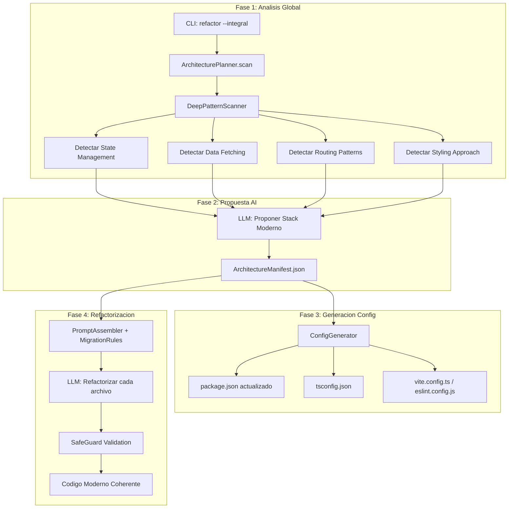

# Refactorización Arquitectónica Integral para Osmosis

## Problema Actual

El sistema actual procesa archivos individualmente sin visión global:

- El `ArchitecturePlanner` existe pero no se usa en el CLI
- Las reglas de migración son estáticas en [`templates.ts`](src/core/prompt-engine/templates.ts)
- No hay generación de configuración del stack moderno
- No hay coherencia entre archivos refactorizados

## Arquitectura Propuesta



## Archivos a Crear/Modificar

### 1. Nuevo: `src/core/architecture/DeepPatternScanner.ts`

Escanea el codigo real (no solo package.json) para detectar patrones:

```typescript
// Detecta patrones especificos en el codigo
interface PatternDetection {
  stateManagement: {
    redux: { connect: number; thunks: number; rtk: boolean };
    mobx: { observables: number };
    context: { providers: number; consumers: number };
    zustand: boolean;
  };
  dataFetching: {
    useEffectAxios: number;      // useEffect + axios/fetch manual
    reactQuery: boolean;
    swr: boolean;
    apollo: boolean;
  };
  routing: {
    version: 'v5' | 'v6' | 'unknown';
    patterns: string[];          // Switch, Routes, withRouter
  };
  styling: {
    styledComponents: boolean;
    cssModules: boolean;
    tailwind: boolean;
    inlineStyles: number;
  };
}
```

Busqueda de patrones con regex/AST:

- `connect(mapStateToProps` -> Redux legacy
- `useSelector|useDispatch` -> Redux moderno
- `useEffect.*axios|fetch` -> Data fetching manual
- `<Switch>|<Route component=` -> React Router v5
- `createBrowserRouter|RouterProvider` -> React Router v6

### 2. Nuevo: `src/core/architecture/ArchitectureManifest.ts`

Interface y persistencia del manifiesto arquitectonico:

```typescript
export interface ArchitectureManifest {
  version: string;
  projectName: string;
  analyzedAt: string;
  
  currentStack: StackAnalysis;
  proposedStack: ProposedStack;
  
  migrationRules: MigrationRule[];
  
  configUpdates: {
    dependencies: Record<string, string>;
    devDependencies: Record<string, string>;
    scripts: Record<string, string>;
  };
}

export interface MigrationRule {
  id: string;
  category: 'state' | 'fetching' | 'routing' | 'styling';
  pattern: string;         // Regex o descripcion
  replacement: string;     // Instruccion para el LLM
  priority: number;
  examples: { before: string; after: string }[];
}
```

### 3. Nuevo: `src/generators/config-generator.ts`

Genera archivos de configuracion modernos:

- **package.json**: Actualiza dependencias, elimina obsoletas, agrega nuevas
- **tsconfig.json**: Configuracion estricta moderna
- **vite.config.ts**: Si se detecta webpack legacy
- **eslint.config.js**: Flat config con reglas modernas
- **.prettierrc**: Formateo consistente

### 4. Modificar: [`src/core/architecture/ArchitecturePlanner.ts`](src/core/architecture/ArchitecturePlanner.ts)

Expandir para:

- Usar `DeepPatternScanner` en lugar de solo leer package.json
- Generar `ArchitectureManifest` completo
- Llamar a `ConfigGenerator`
```typescript
async planFull(projectRoot: string): Promise<ArchitectureManifest> {
  // 1. Scan profundo del codigo
  const scanner = new DeepPatternScanner();
  const patterns = await scanner.scan(projectRoot);
  
  // 2. Consultar LLM para propuesta de stack
  const proposal = await this.generateStackProposal(patterns);
  
  // 3. Generar reglas de migracion especificas
  const rules = await this.generateMigrationRules(patterns, proposal);
  
  // 4. Generar configuracion
  const config = await this.configGenerator.generate(proposal);
  
  return { patterns, proposal, rules, config };
}
```


### 5. Modificar: [`src/core/prompt-engine/assembler.ts`](src/core/prompt-engine/assembler.ts)

Aceptar reglas dinamicas del manifiesto:

```typescript
export interface PromptContext {
  // ... campos existentes
  architectureManifest?: ArchitectureManifest;  // NUEVO
}

static assemble(context: PromptContext): string {
  // ... logica existente
  
  // NUEVO: Inyectar reglas arquitectonicas
  if (context.architectureManifest) {
    prompt += this.injectMigrationRules(context.architectureManifest.migrationRules);
  }
}
```

### 6. Modificar: [`src/cli.ts`](src/cli.ts)

Agregar flag `--integral` al comando refactor:

```typescript
program
  .command('refactor')
  .option('--integral', 'Refactorizacion arquitectonica completa', false)
  .option('--manifest <path>', 'Usar manifiesto existente')
  .action(async (options) => {
    if (options.integral) {
      // Fase 1: Analisis arquitectonico
      const planner = new ArchitecturePlanner(llmService);
      const manifest = await planner.planFull(projectRoot);
      
      // Fase 2: Confirmar con usuario
      console.log('Stack Propuesto:', manifest.proposedStack);
      
      // Fase 3: Generar configuracion
      await configGenerator.write(projectRoot, manifest.configUpdates);
      
      // Fase 4: Refactorizar con contexto del manifiesto
      for (const file of files) {
        const context = { ...baseContext, architectureManifest: manifest };
        // ... refactorizar
      }
    }
  });
```

## Reglas de Migracion por Categoria

### State Management: Redux -> Zustand/RTK

| Patron Legacy | Reemplazo Moderno |

|--------------|-------------------|

| `connect(mapState, mapDispatch)` | `useSelector` + `useDispatch` o `useStore` de Zustand |

| `mapStateToProps` function | Hook `useSelector` con tipado |

| Redux Thunks | RTK Query o TanStack Query |

| `createStore()` | `configureStore()` (RTK) o `create()` (Zustand) |

### Data Fetching: useEffect+axios -> TanStack Query

| Patron Legacy | Reemplazo Moderno |

|--------------|-------------------|

| `useEffect(() => { axios.get... }, [])` | `useQuery({ queryKey, queryFn })` |

| `useState(loading); useState(error)` | Destructuring de `useQuery` |

| `try/catch` en useEffect | `onError` callback en query |

| Polling manual con `setInterval` | `refetchInterval` option |

### Routing: React Router v5 -> v6

| Patron Legacy | Reemplazo Moderno |

|--------------|-------------------|

| `<Switch>` | `<Routes>` |

| `<Route component={X}>` | `<Route element={<X />}>` |

| `withRouter(Component)` | `useNavigate, useParams, useLocation` |

| `history.push()` | `navigate()` |

| `match.params` | `useParams()` |

### Styling: Mixto -> Tailwind CSS

| Patron Legacy | Reemplazo Moderno |

|--------------|-------------------|

| `style={{ marginTop: 10 }}` | `className="mt-2.5"` |

| CSS Modules con muchas clases | Utility classes de Tailwind |

| Styled Components basicos | Tailwind + `clsx` para condicionales |

| SCSS variables | CSS Custom Properties + Tailwind theme |

## Flujo de Ejecucion Completo

1. Usuario ejecuta: `osmosis refactor --source ./src --framework react --integral`
2. **Fase 1**: `DeepPatternScanner` escanea todos los archivos
3. **Fase 2**: LLM analiza patrones y propone stack (ej: "Zustand + TanStack Query + RR v6 + Tailwind")
4. **Fase 3**: Se genera `architecture-manifest.json` con reglas especificas
5. **Fase 4**: `ConfigGenerator` actualiza/crea archivos de configuracion
6. **Fase 5**: Cada archivo se refactoriza con el manifiesto como contexto
7. **Fase 6**: SafeGuard valida coherencia global

## Estructura Final de Archivos

```
src/core/architecture/
  ArchitecturePlanner.ts      # MODIFICAR
  ArchitectureManifest.ts     # CREAR
  DeepPatternScanner.ts       # CREAR
  
src/generators/
  config-generator.ts         # CREAR
  
src/core/prompt-engine/
  assembler.ts                # MODIFICAR
  
src/cli.ts                    # MODIFICAR
```