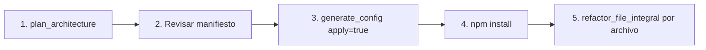

# Osmosis MCP Server - Guía de Instalación para Cursor

## ¿Qué es Osmosis MCP?

Osmosis MCP es un servidor Model Context Protocol que integra las herramientas de modernización de código directamente en Cursor IDE. Permite:

- 🔍 **Analizar proyectos** legacy y detectar tecnologías
- 🏗️ **Planificar arquitectura** moderna (Redux→Zustand, axios→TanStack Query, etc.)
- 📋 **Generar configuración** (tsconfig, eslint, tailwind)
- 🔄 **Refactorizar archivos** con reglas coherentes

## Instalación Rápida

### 1. Clonar y Construir

```bash
# Clonar el repositorio
git clone https://github.com/tu-usuario/osmosis.git
cd osmosis

# Instalar dependencias
npm install

# Construir el proyecto
npm run build
```

### 2. Configurar Variables de Entorno

Crea un archivo `.env` o exporta las variables:

```bash
# Requerido para el LLM
export ANTHROPIC_API_KEY="sk-ant-..."

# Opcional: para embeddings semánticos (si no, usa TF-IDF local)
export OPENAI_API_KEY="sk-..."
```

### 3. Configurar Cursor

#### Opción A: Configuración Global (Recomendada)

Edita el archivo de configuración de Cursor:

**macOS:** `~/.cursor/mcp.json`
**Windows:** `%APPDATA%\Cursor\mcp.json`
**Linux:** `~/.config/cursor/mcp.json`

```json
{
  "mcpServers": {
    "osmosis": {
      "command": "node",
      "args": ["/ruta/completa/a/osmosis/dist/mcp/server.js"],
      "env": {
        "ANTHROPIC_API_KEY": "tu-api-key-aqui"
      }
    }
  }
}
```

#### Opción B: Configuración por Proyecto

Crea un archivo `.cursor/mcp.json` en la raíz de tu proyecto React:

```json
{
  "mcpServers": {
    "osmosis": {
      "command": "node",
      "args": ["../osmosis/dist/mcp/server.js"],
      "env": {
        "ANTHROPIC_API_KEY": "${ANTHROPIC_API_KEY}"
      }
    }
  }
}
```

### 4. Reiniciar Cursor

Cierra y vuelve a abrir Cursor para que detecte el MCP server.

## Herramientas Disponibles

Una vez instalado, tendrás estas herramientas disponibles en Cursor:

### Análisis

| Herramienta | Descripción |
|-------------|-------------|
| `analyze_project` | Análisis completo: tech debt, dependencias, Knowledge Graph |
| `detect_technology` | Detecta jQuery, JSP, PHP, AngularJS, etc. |
| `calculate_tech_debt` | Calcula horas de refactor y archivos tóxicos |

### Arquitectura (NUEVO)

| Herramienta | Descripción |
|-------------|-------------|
| `plan_architecture` | 🏗️ Genera plan de modernización completo |
| `get_architecture_manifest` | Lee el manifiesto existente |
| `generate_config` | Genera tsconfig, eslint, tailwind, etc. |
| `get_migration_rules` | Lista reglas de migración por categoría |

### Migración

| Herramienta | Descripción |
|-------------|-------------|
| `migrate_file` | Migra archivo legacy a React moderno |
| `refactor_file_integral` | 🚀 Refactoriza con el stack del manifiesto |
| `validate_code` | Valida código con SafeGuard |

## Uso en Cursor

### Ejemplo 1: Planificar Arquitectura

En el chat de Cursor, puedes decir:

```
Analiza la arquitectura del proyecto en /Users/me/mi-proyecto-react
y proponme un stack moderno
```

Cursor usará `plan_architecture` automáticamente.

### Ejemplo 2: Refactorizar con Contexto

```
Refactoriza el archivo src/components/UserDashboard.tsx
usando las reglas del manifiesto arquitectónico
```

Cursor usará `refactor_file_integral` y aplicará todas las reglas de migración.

### Ejemplo 3: Ver Reglas de Migración

```
Muéstrame las reglas de migración de estado
para mi proyecto
```

Cursor usará `get_migration_rules` con category='state'.

## Flujo Típico de Uso



1. **Planificar**: Ejecuta `plan_architecture` para analizar el proyecto
2. **Revisar**: Cursor te mostrará el stack propuesto
3. **Configurar**: Usa `generate_config` para crear tsconfig, eslint, etc.
4. **Instalar**: `npm install` las nuevas dependencias
5. **Refactorizar**: Usa `refactor_file_integral` en cada archivo

## Troubleshooting

### El MCP no aparece en Cursor

1. Verifica que `dist/mcp/server.js` existe (ejecuta `npm run build`)
2. Verifica la ruta en `mcp.json`
3. Reinicia Cursor completamente

### Error de API Key

```
Error: ANTHROPIC_API_KEY not configured
```

Asegúrate de que la API key está en el `env` del `mcp.json`:

```json
{
  "env": {
    "ANTHROPIC_API_KEY": "sk-ant-..."
  }
}
```

### Error al ejecutar herramienta

Si ves errores de módulos no encontrados:

```bash
cd /ruta/a/osmosis
npm run build
```

## Desarrollo Local

Para probar cambios en el MCP:

```bash
# Modo desarrollo con hot-reload
npm run mcp:dev

# O manualmente
npx tsx src/mcp/server.ts
```

## Soporte

- 📖 [Documentación completa](./docs/)
- 🐛 [Reportar bugs](https://github.com/tu-usuario/osmosis/issues)
- 💬 [Discusiones](https://github.com/tu-usuario/osmosis/discussions)
